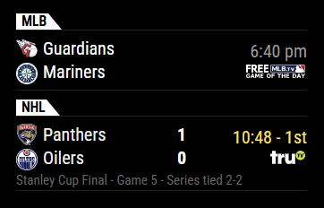

# MMM-MyScoreboard

A [MagicMirror²](https://magicmirror.builders/) module to display today's scores for your favorite teams across a number of different
leagues, including:

* NHL Hockey
* NBA / WNBA / NCAA Basketball
* MLB Baseball
* NFL / NCAA / CFL Football
* Over 100 soccer leagues
* And more

This is a fork of the original MMM-MyScoreboard from user jclarke0000.  It has been updated with bug fixes, security patches, and many feature additions.

Intended to match the design aesthetic of, and pair nicely with, [MMM-MyStandings](https://github.com/dathbe/MMM-MyStandings/).



[](https://MagicMirror.builders)
[](LICENSE.md)

## Installing the Module

```sh
cd ~/MagicMirror/modules
git clone https://github.com/dathbe/MMM-MyScoreboard
cd MMM-MyScoreboard
npm install --omit=dev
```

Dependencies:
* [moment-timezone](https://www.npmjs.com/package/moment-timezone)

Note:  running `npm install` is not strictly necessary unless the main MagicMirror² code is changed to eliminate the moment-timezone dependency.

## Updating the Module

```sh
cd ~/MagicMirror/modules/MMM-MyScoreboard
git pull
npm install --omit=dev
```

## Configuration

Add MMM-MyScoreboard module to the `modules` array in the `config/config.js` file. The following example config shows a minimal configuration option.  More options are described below. 

```js
{
  module: "MMM-MyScoreboard",
  position: "top_right",
  config: {
    viewStyle: "stackedWithLogos",
    showPlayoffStatus: true,
    sports: [
      {
        league: "NHL",
        groups: ["Atlantic"]
      },
      {
        league: "NBA",
        teams: ["TOR"],
        groups: ["Pacific", "Central"]
      },
      {
        league: "MLB",
        teams: ["TOR", "CHW", "NYY"]
      },
      {
        league: "NFL",
        teams: ["BUF", "NYJ", "NYG"]
      },
    ]

  }
},
```

| Option                 | Description
|----------------------- |------------
| `sports`               | **REQUIRED** An array of leagues and teams you wish to follow.<br>See below for instructions to configure your `sports` list.<br><br>**Type** `Array`
| `showLeagueSeparators` | Whether to show separators between different leagues.<br><br>**Type** `Boolean`<br>**Default** `true`
| `colored`              | Whether to present module in colour or black-and-white.<br><br>**Type** `Boolean`<br>**Default** `true`
| `rolloverHours`        | How many hours past midnight to continue to show the previous day's games.<br><br>**Type** `Number`<br>**Default** `3` (i.e.: continue to show yesterday's games until 3:00 AM)
| `alwaysShowToday`      | Whether to show today's games _along with_ the previous day's games during `rolloverHours` period.<br><br>**Type** `Boolean`<br>**Default** `false`
| `viewStyle`            | One of the following: `largeLogos`, `mediumLogos`, `smallLogos`, `oneLine`, `oneLineWithLogos`, `stacked` or `stackedWithLogos`.<br>See below for examples of the view styles.<br><br>**Type** `String`<br>**Default** `largeLogos`
| `shadeRows`            | Whether to shade alternate rows.<br><br>**Type** `Boolean`<br>**Default** `false`
| `highlightWinners`     | For games that are final, the winning team / score is highlighted.<br><br>**Type** `Boolean`<br>**Default** `true`
| `showRankings`         | For the NCAAF and NCAAM, whether to show the rankings for the top 25 teams.<br><br>**Type** `Boolean`<br>**Default** `true`
| `hideBroadcasts`       | Hide the display of broadcast channel when set to `true` (though if you are having problems with how broadcast channels are displayed, please open an Issue with a suggestion).<br><br>**Type** `Boolean`<br>**Default** `false`
| `showLocalBroadcasts`  | Will show all local broadcast channels for all teams in displayed games when set to `true`.<br><br>**Type** `Boolean`<br>**Default** `false` because your local television market might not match with your selected team
| `localMarkets`         | A list of your local markets so that you can display only broadcast stations from your local market.  Use the team abbreviations for any teams in your local broadcast market.  For example, if you live in Los Angeles, you may want to use `['ANA', 'LA', 'LAA', 'LAD', 'LAC', 'LAL', 'LAR', 'LAFC', 'UCLA', 'USC']` (note: 'LAC' will pick up both the Chargers and the Clippers). If you live in Miami, you may only need `['MIA']`.<br><br>**Type** `Array` of `Strings`<br>**Default** `[]`
| `skipChannels`         | A list of channels that you would never like to see displayed (e.g., if you do not subscribe to that channel).  You can find the abbreviation for a channel that displays as a logo by checking `MMM-MyScoreboard/providers/ESPN.js`.  I.e., start with all the channels and remove the ones you don't want.  `skipChannels` will override any other option to display certain channels.<br><br>**Type** `Array` of `Strings`<br>**Default** `[]`
| `displayLocalChannels` | A list of local channels you would like to display, even if `showLocalBroadcasts` is set to `false`.  This allows you to manually set the local broadcast channels you receive.  I.e., start with no channels and add the ones you want.  `displayLocalChannels` will override any other option to turn off channels.<br><br>**Type** `Array` or `Strings`<br>**Default** `[]`
| `maxHeight`            | Limit of the height of the container (in pixels). If there are more games than will fit within this height, a scroll animation will start.  For best results, set the limit to show exactly the number of games you want when static. This ensures that any extra games will be fully hidden.  No animation will occur if there are fewer games than fill the container.<br><br>**Type** `Int`<br>**Default** `10000` (will not set a height limit)
| `scrollSpeed`          | Speed for scrolling. _lower_ numbers are _faster_.<br><br>**Type** `Int`<br>**Default** `6`
| `showPlayoffStatus`    | Displays information about playoff series when set to `true`. (Currently only works with `stacked` and `stackedWithLogos` views without adding custom css.)<br><br>**Type** `Boolean`<br>**Default** `false`

### Configuring Your "Sports" List

Each entry in your `sports` array is an object with the following properties:

| Property   | Description
|----------- |------------
| `league`   | **REQUIRED** e.g.: `"NHL"`. See the list below.<br><br>**Type** `String`
| `teams`    | An array of teams for which you want to see scores.  Specify teams using their shortcodes (e.g.: `"TOR"` for Toronto Maple Leafs).<br>See below for a listing of teams and their short codes<br><br>**Type** `Array`<br>**UPDATE v2.0:** This is no longer required.
| `groups`   | In addition to specifying individual teams, you may also specify groups.  Generally these groups correspond to the league's respective conferences and divisions.  See below for a full listing of groups available for each league. (e.g.: `["Atlantic", "Metropolitan"]` for teams in the Atlantic and Metropolitain divisions.<br><br>**Type** `Array`
| `label`    | If `showLeagueSeparators` is set to `true`, you can optionally set a custom label for the separator. Useful in particular to show something other than `"NCAAM_MM"` for the March Madness tournament.<br><br>**Type** `String`<br />**Default** the value for `league`.

It should be noted that if you specify arrays for both `teams` and `groups` they will be added together.  So it's possible to make a team list out of a division and a few other specific teams.  If you omit both parameters, then all games for the particular league will be shown.

## Available Leagues

Currently this module supports the following leagues.  Use the bold uppercase shortcodes in your config above. Please note that while this module supports well over 100 leagues, please do not abuse this.  We're lucky to be able to use the sports API's free and clear, but there's no telling what might happen if we all configure our modules to get scores for every league.  Please just use configure the leagues you are most interested in.

### Canadian and American Leagues

* `NHL` - National Hockey League
* `MLB` - Major League Baseball
* `WBC` - World Baseball Classic
* `NBA` - National Basketball Association
* `WNBA` - Womens' Basketball Association
* `NBAG` - NBA G League
* `NFL` - National Football League
* `CFL` - Canadian Football League
* `MLS` - Major League Soccer
* `NCAAF` - NCAA College Football (FBS Division only)
* `NCAAM` - NCAA College Basketball (Division I)
* `NCAAM_MM` - NCAA College Basketball (March Madness Tournament)
* `NCAAW` - NCAA Women's College Basketball
* `NLL` - National Lacrosse League
* `PLL` - Premier Lacrosse League

### Other Leagues

* `AFL` - Australian Football League
* `RUGBY` - All Rugby leagues (team abbreviations not maintained here)

**Note:** You can probably guess the team abbreviations based on the city, but team abbreviation code lists for the leagues above are later in this README.  If you notice an error, open an issue and let me know.

### Soccer Leagues & Competitions

#### Most Popular
* `ALL_SOCCER` - Will return all soccer matches.  The list gets very long, so pair this with a `teams` list.  Useful if your team plays in various cups and competitions.  Note that team abbreviations are not necessarily unique, so your mileage may vary with this "league."
* `SOCCER_ON_TV` - Will return all soccer matches that have a broadcast option.  Handy if you just want to know what soccer you can watch today.  It will respect your `skipChannels` list and not display games that are only broadcast on one of those channels.
* `SOCCER_ON_TV_NOW` - Will return all soccer matches currently on tv.  It will respect your `skipChannels` list and not display games that are only broadcast on one of those channels.
* `English Premier League`
* `UEFA_CHAMPIONS` - UEFA Champions League
* `UEFA_EUROPA` - UEFA Europa League
* `UEFA_NATIONS` - UEFA Nations League
* `FIFA_WORLD_CUP` - FIFA World Cup
* `BRA_SERIE_A` - Brazilian Serie A
* `GER_BUNDESLIGA` - German Bundesliga
* `FRA_LIGUE_1` - French Ligue 1
* `CONMEBOL_COPA_LIBERTADORES` - CONMEBOL Copa Libertadores
* `ITA_SERIE_A` - Italian Serie A
* `ESP_LALIGA` - Spanish La Liga
* `MEX_LIGA_BANCOMER` - Mexican Liga BBVA Bancomer

<details>
  <summary><b>Available Soccer Leagues</b> (click to expand)</summary>
 
#### International
* `AFC_ASIAN_CUP` - AFC Asian Cup
* `AFC_ASIAN_CUP_Q` - AFC Asian Cup Qualifying
* `AFF_CUP` - AFF Cup
* `AFR_NATIONS_CUP` - African Nations Cup
* `AFR_NATIONS_CUP_Q` - African Nations Cup Qualifying
* `CONCACAF_GOLD_CUP` - CONCACAF Gold Cup
* `CONCACAF_NATIONS_Q` - CONCACAF Nations League Qualifying
* `CONCACAF_WOMENS_CHAMPIONSHIP` CONCACAF Women's Championship
* `CONMEBOL_COPA_AMERICA` - CONMEBOL Copa America
* `FIFA_CLUB_WORLD_CUP` - FIFA Club World Cup
* `FIFA_CONFEDERATIONS_CUP` - FIFA Confederations Cup
* `FIFA_MENS_FRIENDLIES` - FIFA Men's Friendlies
* `FIFA_MENS_OLYMPICS` - FIFA Men's Olympic Games
* `FIFA_WOMENS_FRIENDLIES` - FIFA Women's Friendlies
* `FIFA_WOMENS_OLYMPICS` - FIFA Women's Olympic Games
* `FIFA_WOMENS_WORLD_CUP` - FIFA Women's World Cup
* `FIFA_WORLD_CUP` - FIFA World Cup
* `FIFA_WORLD_CUP_Q_AFC` - FIFA World Cup Qualifying: AFC
* `FIFA_WORLD_CUP_Q_CAF` - FIFA World Cup Qualifying: CAF
* `FIFA_WORLD_CUP_Q_CONCACAF` - FIFA World Cup Qualifying: CONCACAF
* `FIFA_WORLD_CUP_Q_CONMEBOL` - FIFA World Cup Qualifying: CONMEBOL
* `FIFA_WORLD_CUP_Q_OFC` - FIFA World Cup Qualifying: Oceana
* `FIFA_WORLD_CUP_Q_UEFA` - FIFA World Cup Qualifying: UEFA
* `FIFA_WORLD_U17` - FIFA Under-17 World Cup
* `FIFA_WORLD_U20` - FIFA Under-20 World Cup
* `UEFA_CHAMPIONS` - UEFA Champions League
* `UEFA_WOMENS_CHAMPIONS` - UEFA Women's Champions League
* `UEFA_EUROPEAN_CHAMPIONSHIP` - UEFA European Championship
* `UEFA_EUROPEAN_CHAMPIONSHIP_Q` - UEFA European Championship Qualifying
* `UEFA_EUROPEAN_CHAMPIONSHIP_U19` - UEFA Under-19 Championship
* `UEFA_EUROPEAN_CHAMPIONSHIP_U21` - UEFA Under-21 Championship
* `UEFA_EUROPA` - UEFA Europa League
* `UEFA_EUROPA_CONF` - UEFA Conference League
* `UEFA_NATIONS` - UEFA Nations League
* `SAFF_CHAMPIONSHIP` - SAFF Championship
* `WOMENS_EUROPEAN_CHAMPIONSHIP` - Women's European Championship

#### UK / Ireland
* `ENG_CARABAO_CUP` - English Carabao Cup
* `ENG_CHAMPIONSHIP` - English Championship
* `ENG_EFL` - English EFL Trophy
* `ENG_FA_CUP` - English FA Cup
* `ENG_LEAGUE_1` - English League One
* `ENG_LEAGUE_2` - English League Two
* `ENG_NATIONAL` - English National League
* `ENG_PREMIERE_LEAGUE` - English Premier League
* `IRL_PREM` - League of Ireland Premier Divison
* `NIR_PREM` - Northern Irish Premier League
* `SCO_CHALLENGE_CUP` - Scottish League Challenge Cup
* `SCO_CHAMPIONSHIP` - Scottish Championship
* `SCO_CIS` - Scottish Communities League Cup
* `SCO_CUP` - Scottish Cup
* `SCO_LEAGUE_1` - Scottish League One
* `SCO_LEAGUE_2` - Scottish League Two
* `SCO_PREM` - Scottish Premiership
* `WAL_PREM` - Welsh Premier League
* `ENG_WSL` - English Women's Super League

#### Europe
* `AUT_BUNDESLIGA` - Austrian Bundesliga
* `BEL_DIV_A` - Belgian First Division A
* `DEN_SAS_LIGAEN` - Danish SAS-Ligaen
* `ESP_COPA_DEL_REY` - Spanish Copa del Rey
* `ESP_LALIGA` - Spanish La Liga
* `ESP_SEGUNDA_DIV` - Spanish Segunda Division
* `FRA_COUPE_DE_FRANCE` - French Coupe de France
* `FRA_COUPE_DE_LA_LIGUE` - French Coupe de la Ligue
* `FRA_LIGUE_1` - French Ligue 1
* `FRA_LIGUE_2` - French Ligue 2
* `GER_2_BUNDESLIGA` - German 2. Bundesliga
* `GER_BUNDESLIGA` - German Bundesliga
* `GER_DFB_POKAL` - German DFB Pokal
* `GRE_SUPER_LEAGUE` - Greek Super League
* `ISR_PREMIER_LEAGUE` - Israeli Premier League
* `MLT_PREMIER_LEAGUE` - Maltese Premier League
* `ITA_COPPA_ITALIA` - Italian Coppa Italia
* `ITA_SERIE_A` - Italian Serie A
* `ITA_SERIE_B` - Italian Serie B
* `NED_EERSTE_DIVISIE` - Dutch Eerste Divisie
* `NED_EREDIVISIE` - Dutch Eredivisie
* `NED_KNVB_BEKER` - Dutch KNVB Beker
* `NOR_ELITESERIEN` - Norwegian Eliteserien
* `POR_LIGA` - Portuguese Liga
* `ROU_FIRST_DIV` - Romanian First Divison
* `RUS_PREMIER_LEAGUE` - Russian Premier League
* `SUI_SUPER_LEAGUE` - Swiss Super League
* `SWE_ALLSVENSKANLIGA` - Swedish Allsvenskanliga
* `TUR_SUPER_LIG` - Turkish Super Lig

#### South America
* `ARG_COPA` - Copa Argentina
* `ARG_NACIONAL_B` - Argentine Nacional B
* `ARG_PRIMERA_DIV_B` - Argentine Primera Division B
* `ARG_PRIMERA_DIV_C` - Argentine Primera Division C
* `ARG_PRIMERA_DIV_D` - Argentine Primera Division D
* `ARG_SUPERLIGA` - Argentine Superliga
* `BOL_LIGA_PRO` - Bolivian Liga Profesional
* `BRA_CAMP_CARIOCA` - Brazilian Campeonato Carioca
* `BRA_CAMP_GAUCHO` - Brazilian Campeonato Gaucho
* `BRA_CAMP_MINEIRO` - Brazilian Campeonato Mineiro
* `BRA_CAMP_PAULISTA` - Brazilian Campeonato Paulista
* `BRA_COPA` - Copa Do Brazil
* `BRA_SERIE_A` - Brazilian Serie A
* `BRA_SERIE_B` - Brazilian Serie B
* `BRA_SERIE_C` - Brazilian Serie C
* `CHI_COPA` - Copa Chile
* `CHI_PRIMERA_DIV` - Chilean Primera Division
* `COL_COPA` - Copa Colombia
* `COL_PRIMERA_A` - Colombian Primera A
* `COL_PRIMERA_B` - Colombian Primera B
* `CONMEBOL_COPA_LIBERTADORES` - CONMEBOL Copa Libertadores
* `CONMEBOL_COPA_SUDAMERICANA` - CONMEBOL Copa Sudamericana
* `ECU_PRIMERA_A` - Ecuadoran Primera A
* `PAR_PRIMERA_DIV` - Paraguayan Primera Division
* `PER_PRIMERA_PRO` - Peruvian Primera Profesional
* `URU_PRIMERA_DIV` - Uruguayan Primera Division
* `VEN_PRIMERA_PRO` - Venezuelan Primera Profesional

#### North America
* `CONCACAF_CHAMPIONS` - CONCACAF Champions League
* `CONCACAF_LEAGUE` - CONCACAF League
* `CRC_PRIMERA_DIV` - Costa Rican Primera Division
* `GUA_LIGA_NACIONAL` - Guatemalan Liga Nacional
* `HON_PRIMERA_DIV` - Honduran Primera Division
* `JAM_PREMIER_LEAGUE` - Jamaican Premier League
* `MEX_ASCENSO_MX` - Mexican Ascenso MX
* `MEX_COPA_MX` - Mexican Copa MX
* `MEX_LIGA_BANCOMER` - Mexican Liga BBVA Bancomer
* `SLV_PRIMERA_DIV` - Salvadoran Primera Division
* `MLS` - Major League Soccer
* `USA_NCAA_SL_M` - United States NCAA Men's 1
* `USA_NCAA_SL_W` - United States NCAA Women's 1
* `USA_NASL` - United States North American Soccer League
* `NWSL` - United States NWSL Women's League
* `USA_OPEN` - United States Open Cup 
* `USA_USL` - United States USL Championship
* `NSL` - Canada's Northern Super League
* `CPL` - Canadian Premier League

#### Asia
* `AFC_CHAMPIONS` - AFC Champions League
* `AUS_A_LEAGUE` - Australian A-League
* `CHN_SUPER_LEAGUE` - Chinese Super League
* `IDN_SUPER_LEAGUE` - Indonesian Super League
* `IND_I_LEAGUE` - Indian I-League
* `IND_SUPER_LEAGUE` - Indian Super League
* `JPN_J_LEAGUE` - Japanese J League
* `MYS_SUPER_LEAGUE` - Malaysian Super League
* `SGP_PREMIER_LEAGUE` - Singaporean S-League 
* `THA_PREMIER_LEAGUE` - Thai Premier League

#### Africa
* `CAF_CHAMPIONS` - CAF Champions League
* `CAF_CONFED_CUP` - CAF Confederation Cup
* `GHA_PREMIERE_LEAGUE` - Ghanaian Premier League
* `KEN_PREMIERE_LEAGUE` - Kenyan Premier League
* `NGA_PRO_LEAGUE` - Nigerian Professional League
* `RSA_FIRST_DIV` - South African First Division
* `RSA_NEDBANK_CUP` - South African Nedbank Cup
* `RSA_PREMIERSHIP` - South African Premiership
* `RSA_TELKOM_KNOCKOUT` - South African Telkom Knockout
* `UGA_SUPER_LEAGUE` - Ugandan Super League
* `ZAM_SUPER_LEAGUE` - Zambian Super League
* `ZIM_PREMIER_LEAGUE` - Zimbabwe Super League

</details>

### Rugby Leagues & Competitions

<details>
  <summary><b>Available Rugby Leagues</b> (click to expand)</summary>
 
* `RUGBY` - All Rugby games
* `PREMIERSHIP_RUGBY`
* `RUGBY_WORLD_CUP`
* `SIX_NATIONS`
* `THE_RUGBY_CHAMPIONSHIP`
* `EUROPEAN_RUGBY_CHAMPIONS_CUP`
* `UNITED_RUGBY_CHAMPIONSHIP`
* `SUPER_RUGBY_PACIFIC`
* `OLYMPIC_MENS_7S`
* `OLYMPIC_WOMENS_RUGBY_SEVENS`
* `INTERNATIONAL_TEST_MATCH`
* `URBA_TOP_12`
* `MITRE_10_CUP`
* `Major League Rugby`

</details>

**NOTE** For the soccer and rugby leagues, I won't be maintaining a team code list here.  To follow a specific team, go to ESPN.com, view the table for the league your team plays in and resize your browser to mobile width.  You will see the team's shortcode there.

## View Styles

Examples of the available view styles you can specify with the `viewStyle` parameter.


## Team Shortcodes and Groups

The following are shortcodes and groups for North American sports leagues.


### NHL

<details>
  <summary><b>NHL Codes</b> (click to expand)</summary>

```
Teams:
---------------

ANA   Anaheim Ducks
ARI   Arizona Coyotes
BOS   Boston Bruins
BUF   Buffalo Sabres
CAR   Carolina Hurricanes
CBJ   Columbus Blue Jackets
CGY   Calgary Flames
CHI   Chicago Black Hawks
COL   Colorado Avalanche
DAL   Dallas Stars
DET   Detroit Red Wings
EDM   Edmonton Oilers
FLA   Florida Panthers
LA    Los Angeles Kings
MIN   Minnesota Wild
MTL   Montreal Canadiens
NJ    New Jersey Devils
NSH   Nashville Predators
NYI   New York Islanders
NYR   New York Rangers
OTT   Ottawa Senators
PHI   Philadelphia Flyers
PIT   Pittsburgh Penguins
SEA   Seattle Kraken
SJ    San Jose Sharks
STL   St. Louis Blues
TB    Tampa Bay Lightning
TOR   Toronto Maple Leafs
UTA   Utah Hockey Club
VAN   Vanvouver Canucks
VGK   Vegas Golden Knights
WPG   Winnipeg Jets
WSH   Washington Capitals

Groups:
---------------
Atlantic
Metropolitan
Central
Pacific
East
West
Canadian (group that includes all seven Canadian teams)
```
</details>

### MLB

<details>
  <summary><b>MLB Codes</b> (click to expand)</summary>

```
Teams:
---------------

ARI    Arizona Diamondbacks
ATH   Athletics
ATL   Atlanta Braves
BAL   Baltimore Orioles
BOS   Boston Red Sox
CHC   Chicago Cubs
CIN   Cincinnati reds
CLE   Cleveland Guardians
COL   Colorado Rockies
CWS   Chicago White Sox
DET   Detroit Tigers
HOU   Houston Astros
KC    Kansas City Royals
LAA   Los Angeles Angels
LAD   Los Angeles Dodgers
MIA   Miami Marlins
MIL   Milwaukee Brewers
MIN   Minnesota Twons
NYM   New York Mets
NYY   New York Yankees
PHI   Philadelphia Phillies
PIT   Pittsburgh Pirates
SD    San Diego Padres
SEA   Seattle Mariners
SF    San Francisco Giants
STL   St. Louis Cardinals
TB    Tampa Bay Rays
TEX   Texas Rangers
TOR   Toronto Blue Jays
WSH   Washington Nationals
AL    American League All-Star team
NL    National League All-Star team

Groups:
---------------
AL East
AL Central
AL West
NL East
NL Central
NL West
American League
National League
```
</details>

### WBC (World Baseball Classic)

<details>
  <summary><b>WBC Codes</b> (click to expand)</summary>

```
Teams:
---------------
AUS   Australia
CAN   Canada
CHN   China
COL   Colombia
CUB   Cuba
CZE   Czech Republic
DOM   Dominican Republic
GBR   Great Britain
ISR   Israel
ITA   Italy
JPN   Japan
KOR   Korea
MEX   Mexico
NCA   Nicaragua
NED   Netherlands
PAN   Panama
PUR   Puerto Rico
TPE   Chinese Taipei
USA   United States
VEN   Venezuela
```
</details>

### NBA

<details>
  <summary><b>NBA Codes</b> (click to expand)</summary>

```
Teams:
---------------

ATL   Atlanta Hawks
BKN   Brooklyn Nets
BOS   Boston Celtics
CHA   Charlotte Hornets
CHI   Chicago Bulls
CLE   Cleveland Cavaliers
DAL   Dallas Mavericks
DEN   Denver Nuggets
DET   Detroit Pistons
GS    Golden State Warriors
HOU   Houston Rockets
IND   Indiana Pacers
LAC   Los Angeles Clippers
LAL   Los Angeles Lakers
MEM   Memphis Grizzlies
MIA   Miami Heat
MIL   Milwaukee Bucks
MIN   Minnesota Timberwolves
NO    New Orleans Pelicans
NY    New York Knicks
OKC   Oklahoma City Thunder
ORL   Orlando Magic
PHI   Philadelphia 76ers
PHX   Phoenix Suns
POR   Portland Trail Blazers
SAC   Sacramento Kings
SA    San Antonio Spurs
TOR   Toronto Raptors
UTAH  Utah Jazz
WSH   Washington Wizards

Groups:
---------------
Atlantic
Central
Southeast
Northwest
Pacific
Southwest
East
West
```
</details>

### WNBA

<details>
  <summary><b>WNBA Codes</b> (click to expand)</summary>

```
Teams:
---------------
ATL   Atlanta Dream
CHI   Chicago Sky
CONN  Connecticut Sun
DAL   Dallas Wings
IND   Indiana Fever
LA    Los Angeles Sparks
LV    Las Vegas Aces
MIN   Minnesota Lynx
NY    New York Liberty
PHX   Phoenix Mercury
SEA   Seattle Storm
WSH   Washington Mystics

Groups:
---------------
East
West
```
</details>

### NBA G League ("NBAG")

<details>
  <summary><b>NBA G League Codes</b> (click to expand)</summary>

```
Use `NBAG` for the league code

Teams:
---------------
- WCB - Windy City Bulls
- BIR - Birmingham Squadron
- RAP - Raptors 905
- DEL - Delaware Blue Coats
- GRD - Grand Rapids Gold
- CLC - Cleveland Charge
- CPS - College Park Skyhawks
- LIN - Long Island Nets
- MCC - Motor City Cruise
- WIS - Wisconsin Herd
- CAP - Capital City Go-Go
- GBO - Greensboro Swarm
- IMA - Indiana Mad Ants
- MNE - Maine Celtics
- OSC - Osceola Magic
- WES - Westchester Knicks
- IWA - Iowa Wolves
- TEX - Texas Legends
- SAN - San Diego Clippers
- RCITY - Rip City Remix
- MHU - Memphis Hustle
- SBL - South Bay Lakers
- MXC - Mexico City Capitanes
- OKL - Oklahoma City Blue
- SXF - Sioux Falls Skyforce
- RGV - Rio Grande Valley Vipers
- SCW - Santa Cruz Warriors
- VALLEY - Valley Suns
- SLC - Salt Lake City Stars
- STO - Stockton Kings
- AUS - Austin Spurs

Groups:
---------------
East
West
```
</details>

### NFL

<details>
  <summary><b>NFL Codes</b> (click to expand)</summary>

```
Teams:
---------------

ARI   Arizona Cardinals
ATL   Atlanta Falcons
BAL   Baltimore Ravens
BUF   Buffalo Bills
CAR   Carolina Panthers
CHI   Chicago Bears
CIN   Cincinati Bengals
CLE   Cleveland Browns
DAL   Dallas Cowboys
DEN   Denver Broncos
DET   Detroit Lions
GB    Green Bay Packers
HOU   Houston Texans
IND   Indianapolis Colts
JAX   Jacksonville Jaguars
KC    Kansas City Chiefs
LAR   Los Angeles Rams
LAC   Los Angeles Chargers
LV    Las Vegas Raiders
MIA   Miami Dolphins
MIN   Minnesota Vikings
NE    New England Patriots
NO    New Orleans Saints
NYG   New York Giants
NYJ   New York Jets
PHI   Philadelphia Eagles
PIT   Pittsburgh Steelers
SEA   Seattle Seahawks
SF    San Francisco 49ers
TB    Tampa Bay Buccaneers
TEN   Tennessee Titans
WSH   Washington Commanders

Groups:
---------------
AFC East
AFC North
AFC South
AFC West
NFC East
NFC North
NFC South
NFC West
AFC
NFC
```
</details>

### CFL

<details>
  <summary><b>CFL Codes</b> (click to expand)</summary>

```
Teams:
---------------

BC    B.C. Lions
CGY   Calgary Stampeders
EDM   Edmonton Elks
HAM   Hamilton Tiger-Cats
MTL   Montreal Alouetts
OTT   Ottawa Redblacks
SSK   Saskatchewan Roughriders
TOR   Toronto Argonauts
WPG   Winnipeg Blue Bombers

Groups:
---------------
East
West
```
</details>


### MLS

<details>
  <summary><b>MLS Codes</b> (click to expand)</summary>

```
Teams:
---------------

ATL   Atlanta United FC
ATX   Austin FC
CLT   Charlotte FC
CHI   Chicago Fire FC
CIN   FC Cincinnati
COL   Colorado Rapids
CLB   Columbus Crew
DC    D.C. United
DAL   FC Dallas
HOU   Houston Dynamo FC
SKC   Sporting Kansas City
LA    LA Galaxy
LAFC  Los Angeles FC
MIA   Inter Miami CF
MNU   Minnesota United
MTL   CF Montreal
NSH   Nashville SC
NE    New England Revolution
NY    New York Red Bulls
NYC   New York City FC
ORL   Orlando City
PHI   Philadelphia Union
POR   Portland Timbers
RSL   Real Salt Lake
SD    San Diego FC
SJE   San Jose Earthquakes
SEA   Seattle Sounders FC
STL   St. Louis City SC
TOR   Toronto FC
WHI   Vancouver Whitecaps FC

Groups:
---------------
East
West
```
</details>


### NCAAF (FBS Division)

<details>
  <summary><b>NCAAF Codes</b> (click to expand)</summary>

```
Teams:
---------------

AFA   Air Force Falcons
AKR   Akron Zips
ALA   Alabama Crimson Tide
APP   Appalachian State Mountaineers
ARIZ  Arizona Wildcats
ARK   Arkansas Razorbacks
ARMY  Army West Point Black Knights
ARST  Arkansas State Red Wolves
ASU   Arizona State Devils
AUB   Auburn Tigers
BALL  Ball State Cardinals
BAY   Baylor Bears
BC    Boston College Eagles
BGSU  Bowling Green Falcons
BSU   Boise State Broncos
BUFF  Buffalo Bulls
BYU   BYU Cougars
CAL   California Golden Bears
CCU   Coastal Carolina Chanticleers
CHAR  Charlotte 49ers
CIN   Cincinnati Bearcats
CLEM  Clemson Tigers
CMU   Central Michigan Chippewas
COLO  Colorado Buffalos
CONN  Connecticut Juskies
CSU   Colorado State Rams
DUKE  Duke Blue Devils
ECU   East Carolina Pirates
EMU   Eastern Michigan Eagles
FAU   Florida Atlantic Owls
FIU   Florida International Golden Panthers
FLA   Florida Gators
FRES  Fresno State Bulldogs
FSU   Florida State Seminoles
GASO  Georgia Southern Eagles
GAST  Georgia State Panthers
GT    Georgia Tech Yellow Jackets
HAW   Hawaii Rainbow Warriors
HOU   Houston Cougars
IDHO  Idaho Vandals
ILL   Illinois Fighting Illini
IND   Indiana Hoosiers
IOWA  Iowa Hawkeyes
ISU   Iowa State Cyclones
KENT  Kent State Golden Flashes
KSU   Kansas State Wildcats
KU    Kansas Jayhawks
LOU   Louisville Cardinals
LSU   LSU Tigers
LT    Louisianna Tech Bulldogs
M-OH  Miami (OH) Redhawks
MD    Maryland Terrapins
MEM   Memphis Tigers
MIAMI Miami Hurricanes
MICH  Michigan Wolverines
MINN  Minnesota Golden Gophers
MISS  Ole Miss Rebels
MIZ   Missouri Tigers
MRSH  Marshall Thundering Herd
MSST  Mississippi State Bulldogs
MSU   Michigan State Spartans
MTSU  Middle Tennessee Blue Raiders
NAVY  Navy Midshipmen
NCST  North Carolina State Wolfpack
ND    Notre Dame Fighting Irish
NEB   Nebraska Cornhuskers
NEV   Nevada Wolf Pack
NIU   Northern Illinois Huskies
NMSU  New Mexico State Aggies
NW    Northwestern Wildcats
ODU   Old Dominion Monarchs
OHIO  Ohio Bobcats
OKLA  Oklahoma Sooners
OKST  Oklahoma State Cowboys
ORE   Oregon Ducks
ORST  Oregon State Beavers
OSU   Ohio State Buckeyes
PITT  Pittsburgh Panthers
PSU   Penn State Nittany Lions
PUR   Purdue Boilermakers
RICE  Rice Owls
RUTG  Rutgers Scarlet Knights
SC    South Carolina Gamecocks
SDSU  San Diego State Aztecs
SJSU  San Jose State Spartans
SMU   SMU Mustangs
STAN  Stanford Cardinal
SYR   Syracuse Orange
TA&M  Texas A&M Aggies
TCU   TCU Horned Frogs
TEM   Temple Owls
TENN  Tennessee Volunteers
TEX   Texas Long Horns
TLSA  Tulsa Golden Hurricane
TOL   Toledo Rockets
TROY  Troy Trojans
TTU   Texas Tech Red Raiders
TULN  Tulane Green Wave
TXST  Texas State Bobcats
UAB   UAB Blazers
UCF   UCF Knights
UCLA  UCLA Bruins
UGA   Georgia Bulldogs
UK    Kentucky Wildcats
ULL   Louisianna-Lafayette Ragin' Cajuns
ULM   Louisianna-Monroe Warhawks
UMASS Massachusetts Minutemen
UNC   North Carolina Tar Heels
UNLV  UNLV Rebels
UNM   New Mexico Lobos
UNT   North Texas Mean Green
USA   South Alabama Jaguars
USC   USC Trojans
USF   South Florida Bulls
USM   Southern Mississippi Golden Eagles
USU   Utah State Aggies
UTAH  Utah Utes
UTEP  UTEP Miners
UTSA  UT San Antonio Roadrunners
UVA   Virginia Cavaliers
VAN   Vanderbilt Commodores
VT    Virginia Tech Hokies
WAKE  Wake Forest Demon Deacons
WASH  Washington Huskies
WISC  Wisconsin Badgers
WKU   Western Kentucky Hilltoppers
WMU   Western MNichigan Broncos
WSU   Washington State Cougars
WVU   West Virginia Mountaineers
WYO   Wyoming Cowboys

Groups:
---------------
Top 25
American Athletic
ACC
Big 12
Big Ten
Conference USA
FBS Independents
Mid-American
Mountain West
Pac-12
SEC
Sun Belt
```
</details>

### NCAAM (Division I and March Madness)

<details>
  <summary><b>NCAAM Codes</b> (click to expand)</summary>

```
Teams:
---------------

AAMU  Alabama A&M Bulldogs
ACU   Abilene Christian Wildcats
AFA   Air Force Falcons
AKR   Akron Zips
ALA   Alabama Crimson Tide
ALBY  Albany Great Danes
ALCN  Alcorn State Braves
ALST  Alabama State Hornets
AMCC  Texas A&M-CC Islanders
AMER  American Eagles
APP   Appalachian State Mountaineers
ARIZ  Arizona Wildcats
ARK   Arkansas Razorbacks
ARMY  Army Black Knights
ARST  Arkansas State Red Wolves
ASU   Arizona State Sun Devils
AUB   Auburn Tigers
BALL  Ball State Cardinals
BAY   Baylor Bears
BC    Boston College Eagles
BCU   Bethune-Cookman Wildcats
BEL   Belmont Bruins
BGSU  Bowling Green Falcons
BING  Binghamton Bearcats
BRAD  Bradley Braves
BRWN  Brown Bears
BRY   Bryant Bulldogs
BSU   Boise State Broncos
BU    Boston University Terriers
BUCK  Bucknell Bison
BUFF  Buffalo Bulls
BUT   Butler Bulldogs
BYU   BYU Cougars
CAL   California Golden Bears
CAM   Campbell Fighting Camels
CAN   Canisius Golden Griffins
CCAR  Coastal Carolina Chanticleers
CCSU  Central Connecticut Blue Devils
CHAR  Charlotte 49ers
CHAT  Chattanooga Mocs
CHS   Chicago State Cougars
CHSO  Charleston Southern Buccaneers
CIN   Cincinnati Bearcats
CIT   The Citadel Bulldogs
CLEM  Clemson Tigers
CLEV  Cleveland State Vikings
CLMB  Columbia Lions
CMU   Central Michigan Chippewas
COFC  Charleston Cougars
COLG  Colgate Raiders
COLO  Colorado Buffaloes
CONN  Connecticut Huskies
COPP  Coppin State Eagles
COR   Cornell Big Red
CP    Cal Poly Mustangs
CREI  Creighton Bluejays
CSB   CSU Bakersfield Roadrunners
CSF   CS Fullerton Titans
CSU   Colorado State Rams
CSUN  CSU Northridge Matadors
DART  Dartmouth Big Green
DAV   Davidson Wildcats
DAY   Dayton Flyers
DEL   Delaware Blue Hens
DEN   Denver Pioneers
DEP   DePaul Blue Demons
DET   Detroit Mercy Titans
DREX  Drexel Dragons
DRKE  Drake Bulldogs
DSU   Delaware State Hornets
DUKE  Duke Blue Devils
DUQ   Duquesne Dukes
ECU   East Carolina Pirates
EIU   Eastern Illinois Panthers
EKY   Eastern Kentucky Colonels
ELON  Elon Phoenix
EMU   Eastern Michigan Eagles
ETSU  East Tennessee State Buccaneers
EVAN  Evansville Purple Aces
EWU   Eastern Washington Eagles
FAIR  Fairfield Stags
FAMU  Florida A&M Rattlers
FAU   Florida Atlantic Owls
FDU   Fairleigh Dickinson Knights
FGCU  Florida Gulf Coast Eagles
FIU   Florida Intl Golden Panthers
FLA   Florida Gators
FOR   Fordham Rams
FRES  Fresno State Bulldogs
FSU   Florida State Seminoles
FUR   Furman Paladins
GASO  Georgia Southern Eagles
GAST  Georgia State Panthers
GB    Green Bay Phoenix
GCU   Grand Canyon Antelopes
GMU   George Mason Patriots
GONZ  Gonzaga Bulldogs
GRAM  Grambling Tigers
GT    Georgia Tech Yellow Jackets
GTWN  Georgetown Hoyas
GW    George Washington Colonials
HALL  Seton Hall Pirates
HAMP  Hampton Pirates
HART  Hartford Hawks
HARV  Harvard Crimson
HAW   Hawai'i Rainbow Warriors
HBU   Houston Baptist Huskies
HC    Holy Cross Crusaders
HOF   Hofstra Pride
HOU   Houston Cougars
HOW   Howard Bison
HP    High Point Panthers
IDHO  Idaho Vandals
IDST  Idaho State Bengals
ILL   Illinois Fighting Illini
ILST  Illinois State Redbirds
IND   Indiana Hoosiers
INST  Indiana State Sycamores
IONA  Iona Gaels
IOWA  Iowa Hawkeyes
IPFW  Fort Wayne Mastodons
ISU   Iowa State Cyclones
IUPU  IUPUI Jaguars
IW    Incarnate Word Cardinals
JAC   Jacksonville Dolphins
JKST  Jackson State Tigers
JMU   James Madison Dukes
JOES  Saint Joseph's Hawks
JVST  Jacksonville State Gamecocks
KENN  Kennesaw State Owls
KENT  Kent State Golden Flashes
KSU   Kansas State Wildcats
KU    Kansas Jayhawks
L-IL  Loyola-Chicago Ramblers
L-MD  Loyola (MD) Greyhounds
LAF   Lafayette Leopards
LAM   Lamar Cardinals
LAS   La Salle Explorers
LBSU  Long Beach State 49ers
LEH   Lehigh Mountain Hawks
LIB   Liberty Flames
LIP   Lipscomb Bisons
LIU   LIU Brooklyn Blackbirds
LMU   Loyola Marymount Lions
LONG  Longwood Lancers
LOU   Louisville Cardinals
LSU   LSU Tigers
LT    Louisiana Tech Bulldogs
M-OH  Miami (OH) RedHawks
MAINE Maine Black Bears
MAN   Manhattan Jaspers
MARQ  Marquette Golden Eagles
MCNS  McNeese Cowboys
MD    Maryland Terrapins
MEM   Memphis Tigers
MER   Mercer Bears
MIA   Miami Hurricanes
MICH  Michigan Wolverines
MILW  Milwaukee Panthers
MINN  Minnesota Golden Gophers
MISS  Ole Miss Rebels
MIZ   Missouri Tigers
MONM  Monmouth Hawks
MONT  Montana Grizzlies
MORE  Morehead State Eagles
MORG  Morgan State Bears
MOST  Missouri State Bears
MRSH  Marshall Thundering Herd
MRST  Marist Red Foxes
MSM   Mt. St. Mary's Mountaineers
MSST  Mississippi State Bulldogs
MSU   Michigan State Spartans
MTST  Montana State Bobcats
MTU   Middle Tennessee Blue Raiders
MURR  Murray State Racers
MVSU  Mississippi Valley State Delta Devils
NAU   Northern Arizona Lumberjacks
NAVY  Navy Midshipmen
NCAT  North Carolina A&T Aggies
NCCU  North Carolina Central Eagles
NCST  NC State Wolfpack
ND    Notre Dame Fighting Irish
NDSU  North Dakota St Bison
NE    Northeastern Huskies
NEB   Nebraska Cornhuskers
NEV   Nevada Wolf Pack
NIAG  Niagara Purple Eagles
NICH  Nicholls Colonels
NIU   Northern Illinois Huskies
NJIT  NJIT Highlanders
NKU   Northern Kentucky Norse
NMSU  New Mexico State Aggies
NSU   Norfolk State Spartans
NW    Northwestern Wildcats
NWST  Northwestern State Demons
OAK   Oakland Golden Grizzlies
ODU   Old Dominion Monarchs
OHIO  Ohio Bobcats
OKLA  Oklahoma Sooners
OKST  Oklahoma State Cowboys
OMA   Omaha Mavericks
ORE   Oregon Ducks
ORST  Oregon State Beavers
ORU   Oral Roberts Golden Eagles
OSU   Ohio State Buckeyes
PAC   Pacific Tigers
PEAY  Austin Peay Governors
PENN  Pennsylvania Quakers
PEPP  Pepperdine Waves
PITT  Pittsburgh Panthers
PORT  Portland Pilots
PRE   Presbyterian College Blue Hose
PRIN  Princeton Tigers
PROV  Providence Friars
PRST  Portland State Vikings
PSU   Penn State Nittany Lions
PUR   Purdue Boilermakers
PV    Prairie View A&M Panthers
QUIN  Quinnipiac Bobcats
RAD   Radford Highlanders
RICE  Rice Owls
RICH  Richmond Spiders
RID   Rider Broncs
RMU   Robert Morris Colonials
RUTG  Rutgers Scarlet Knights
SAC   Sacramento State Hornets
SAM   Samford Bulldogs
SAV   Savannah State Tigers
SBON  St. Bonaventure Bonnies
SC    South Carolina Gamecocks
SCST  South Carolina State Bulldogs
SCU   Santa Clara Broncos
SDAK  South Dakota Coyotes
SDST  South Dakota State Jackrabbits
SDSU  San Diego State Aztecs
SEA   Seattle Redhawks
SELA  SE Louisiana Lions
SEMO  Southeast Missouri State Redhawks
SF    San Francisco Dons
SFA   Stephen F. Austin Lumberjacks
SFNY  St. Francis (BKN) Terriers
SFU   St. Francis (PA) Red Flash
SHSU  Sam Houston State Bearkats
SHU   Sacred Heart Pioneers
SIE   Siena Saints
SIU   Southern Illinois Salukis
SIUE  SIU-Edwardsville Cougars
SJSU  San José State Spartans
SJU   St. John's Red Storm
SLU   Saint Louis Billikens
SMC   Saint Mary's Gaels
SMU   SMU Mustangs
SOU   Southern Jaguars
SPU   Saint Peter's Peacocks
STAN  Stanford Cardinal
STET  Stetson Hatters
STON  Stony Brook Seawolves
SUU   Southern Utah Thunderbirds
SYR   Syracuse Orange
TAMU  Texas A&M Aggies
TCU   TCU Horned Frogs
TEM   Temple Owls
TENN  Tennessee Volunteers
TEX   Texas Longhorns
TLSA  Tulsa Golden Hurricane
TNST  Tennessee State Tigers
TNTC  Tennessee Tech Golden Eagles
TOL   Toledo Rockets
TOWS  Towson Tigers
TRGV  UT Rio Grande Valley Vaqueros
TROY  Troy Trojans
TTU   Texas Tech Red Raiders
TULN  Tulane Green Wave
TXSO  Texas Southern Tigers
TXST  Texas State Bobcats
UAB   UAB Blazers
UALR  Little Rock Trojans
UAPB  Arkansas-Pine Bluff Golden Lions
UCA   Central Arkansas Bears
UCD   UC Davis Aggies
UCF   UCF Knights
UCI   UC Irvine Anteaters
UCLA  UCLA Bruins
UCRV  UC Riverside Highlanders
UCSB  UC Santa Barbara Gauchos
UGA   Georgia Bulldogs
UIC   UIC Flames
UK    Kentucky Wildcats
ULL   Louisiana Ragin' Cajuns
ULM   UL Monroe Warhawks
UMASS Massachusetts Minutemen
UMBC  UMBC Retrievers
UMES  Maryland-Eastern Shore Hawks
UMKC  UMKC Kangaroos
UML   UMass Lowell River Hawks
UNC   North Carolina Tar Heels
UNCA  UNC Asheville Bulldogs
UNCG  UNC Greensboro Spartans
UNCO  Northern Colorado Bears
UNCW  UNC Wilmington Seahawks
UND   North Dakota Fighting Hawks
UNF   North Florida Ospreys
UNH   New Hampshire Wildcats
UNI   Northern Iowa Panthers
UNLV  UNLV Rebels
UNM   New Mexico Lobos
UNO   New Orleans Privateers
UNT   North Texas Mean Green
UPST  South Carolina Upstate Spartans
URI   Rhode Island Rams
USA   South Alabama Jaguars
USC   USC Trojans
USD   San Diego Toreros
USF   South Florida Bulls
USM   Southern Miss Golden Eagles
USU   Utah State Aggies
UTA   UT Arlington Mavericks
UTAH  Utah Utes
UTEP  UTEP Miners
UTM   UT Martin Skyhawks
UTSA  UT San Antonio Roadrunners
UVA   Virginia Cavaliers
UVM   Vermont Catamounts
UVU   Utah Valley Wolverines
VALP  Valparaiso Crusaders
VAN   Vanderbilt Commodores
VCU   VCU Rams
VILL  Villanova Wildcats
VMI   VMI Keydets
VT    Virginia Tech Hokies
WAG   Wagner Seahawks
WAKE  Wake Forest Demon Deacons
WASH  Washington Huskies
WCU   Western Carolina Catamounts
WEB   Weber State Wildcats
WEBB  Gardner-Webb Bulldogs
WICH  Wichita State Shockers
WIN   Winthrop Eagles
WISC  Wisconsin Badgers
WIU   Western Illinois Leathernecks
WKU   Western Kentucky Hilltoppers
WM    William & Mary Tribe
WMU   Western Michigan Broncos
WOF   Wofford Terriers
WRST  Wright State Raiders
WSU   Washington State Cougars
WVU   West Virginia Mountaineers
WYO   Wyoming Cowboys
XAV   Xavier Musketeers
YALE  Yale Bulldogs
YSU   Youngstown State Penguins

Groups (Division I only.  No groups for March Madness):
---------------
Top 25
America East
American
Atlantic 10
ACC
Atlantic Sun
Big 12
Big East
Big Sky
Big South
Big Ten
Big West
Colonial
Conference USA
Horizon
Ivy
MAAC
Mid-American
MEAC
Missouri Valley
Mountain West
Northeast
Ohio Valley
Pac-12
Patriot League
SEC
Southern
Southland
SWAC
Summit League
Sun Belt
West Coast
WAC
```
</details>

### NCAAW

<details>
  <summary><b>NCAAW Codes</b> (click to expand)</summary>

```
Teams:
---------------

ACU   Abilene Christian Wildcats
AFA   Air Force Falcons
AKR   Akron Zips
AAMU  Alabama A&M Bulldogs
ALA   Alabama Crimson Tide
ALST  Alabama State Lady Hornets
ALB   Albany Great Danes
ALCN  Alcorn State Lady Braves
AMER  American University Eagles
APP   Appalachian State Mountaineers
ASU   Arizona State Sun Devils
ARIZ  Arizona Wildcats
ARK   Arkansas Razorbacks
ARST  Arkansas State Red Wolves
UAPB  Arkansas-Pine Bluff Golden Lions
ARMY  Army Black Knights
AUB   Auburn Tigers
APSU  Austin Peay Governors
BYU   BYU Cougars
BALL  Ball State Cardinals
BAY   Baylor Bears
BELL  Bellarmine Knights
BEL   Belmont Bruins
BCU   Bethune-Cookman Wildcats
BING  Binghamton Bearcats
BOIS  Boise State Broncos
BC    Boston College Eagles
BU    Boston University Terriers
BGSU  Bowling Green Falcons
BRAD  Bradley Braves
BRWN  Brown Bears
BRY   Bryant Bulldogs
BUCK  Bucknell Bison
BUFF  Buffalo Bulls
BUT   Butler Bulldogs
CSUN  CSU Northridge Matadors
CP    Cal Poly Mustangs
CSUB  Cal State Bakersfield Roadrunners
CSUF  Cal State Fullerton Titans
CBU   California Baptist Lancers
CAL   California Golden Bears
CAM   Campbell Fighting Camels
CAN   Canisius Golden Griffins
CARK  Central Arkansas Bears
CCSU  Central Connecticut Blue Devils
CMU   Central Michigan Chippewas
COFC  Charleston Cougars
CHSO  Charleston Southern Buccaneers
CLT   Charlotte 49ers
UTC   Chattanooga Mocs
CHST  Chicago State Cougars
CIN   Cincinnati Bearcats
CLEM  Clemson Tigers
CLEV  Cleveland State Vikings
CCU   Coastal Carolina Chanticleers
COLG  Colgate Raiders
COLO  Colorado Buffaloes
CSU   Colorado State Rams
COLU  Columbia Lions
COPP  Coppin State Eagles
COR   Cornell Big Red
CREI  Creighton Bluejays
DART  Dartmouth Big Green
DAV   Davidson Wildcats
DAY   Dayton Flyers
DEP   DePaul Blue Demons
DEL   Delaware Blue Hens
DSU   Delaware State Lady Hornets
DEN   Denver Pioneers
DETM  Detroit Mercy Titans
DRKE  Drake Bulldogs
DREX  Drexel Dragons
DUKE  Duke Blue Devils
DUQ   Duquesne Dukes
ECU   East Carolina Pirates
ETSU  East Tennessee State Bucs
EIU   Eastern Illinois Panthers
EKU   Eastern Kentucky Colonels
EMU   Eastern Michigan Eagles
EWU   Eastern Washington Eagles
ELON  Elon Phoenix
EVAN  Evansville Purple Aces
FAIR  Fairfield Stags
FDU   Fairleigh Dickinson Knights
FAMU  Florida A&M Rattlers
FAU   Florida Atlantic Owls
FLA   Florida Gators
FGCU  Florida Gulf Coast Eagles
FIU   Florida International Panthers
FSU   Florida State Seminoles
FOR   Fordham Rams
FRES  Fresno State Bulldogs
FUR   Furman Paladins
GWEB  Gardner-Webb Runnin' Bulldogs
GMU   George Mason Patriots
GW    George Washington Colonials
GTWN  Georgetown Hoyas
UGA   Georgia Lady Bulldogs
GASO  Georgia Southern Eagles
GAST  Georgia State Panthers
GT    Georgia Tech Yellow Jackets
GONZ  Gonzaga Bulldogs
GRAM  Grambling Lady Tigers
GCU   Grand Canyon Lopes
GB    Green Bay Phoenix
HAMP  Hampton Lady Pirates
HART  Hartford Hawks
HARV  Harvard Crimson
HAW   Hawai'i Rainbow Wahine
HPU   High Point Panthers
HOF   Hofstra Pride
HC    Holy Cross Crusaders
HCU   Houston Christian Huskies
HOU   Houston Cougars
HOW   Howard Bison
IUPU  IUPUI Jaguars
IDST  Idaho State Bengals
IDHO  Idaho Vandals
ILL   Illinois Fighting Illini
ILST  Illinois State Redbirds
UIW   Incarnate Word Cardinals
IU    Indiana Hoosiers
INST  Indiana State Sycamores
IONA  Iona Gaels
IOWA  Iowa Hawkeyes
ISU   Iowa State Cyclones
JKST  Jackson State Lady Tigers
JAX   Jacksonville Dolphins
JVST  Jacksonville State Gamecocks
JMU   James Madison Dukes
KC    Kansas City Roos
KU    Kansas Jayhawks
KSU   Kansas State Wildcats
KENN  Kennesaw State Owls
KENT  Kent State Golden Flashes
UK    Kentucky Wildcats
LSU   LSU Tigers
LAS   La Salle Explorers
LAF   Lafayette Leopards
LAM   Lamar Cardinals
LEH   Lehigh Mountain Hawks
LIB   Liberty Flames
LIN   Lindenwood Lions
LIP   Lipscomb Bisons
LR    Little Rock Trojans
LBSU  Long Beach State Beach
LIU   Long Island University Sharks
LONG  Longwood Lancers
UL    Louisiana Ragin' Cajuns
LT    Louisiana Tech Lady Techsters
LOU   Louisville Cardinals
LUC   Loyola Chicago Ramblers
L-MD  Loyola Maryland Greyhounds
LMU   Loyola Marymount Lions
MAINE Maine Black Bears
MAN   Manhattan Jaspers
MRST  Marist Red Foxes
MARQ  Marquette Golden Eagles
MRSH  Marshall Thundering Herd
MD    Maryland Terrapins
UMES  Maryland-Eastern Shore Lady Hawks
MCN   McNeese Cowgirls
MEM   Memphis Tigers
MER   Mercer Bears
MRMK  Merrimack Warriors
M-OH  Miami (OH) Redhawks
MIA   Miami Hurricanes
MSU   Michigan State Spartans
MICH  Michigan Wolverines
MTSU  Middle Tennessee Lady Raiders
MILW  Milwaukee Panthers
MINN  Minnesota Golden Gophers
MSST  Mississippi State Bulldogs
MVSU  Mississippi Valley State Devilettes
MOST  Missouri State Lady Bears
MIZ   Missouri Tigers
MONM  Monmouth Hawks
MONT  Montana Lady Griz
MTST  Montana State Bobcats
MORE  Morehead State Eagles
MORG  Morgan State Lady Bears
MSM   Mount St. Mary's Mountaineers
MUR   Murray State Racers
NCST  NC State Wolfpack
NJIT  NJIT Highlanders
NAVY  Navy Midshipmen
NEB   Nebraska Cornhuskers
NEV   Nevada Wolf Pack
UNH   New Hampshire Wildcats
UNM   New Mexico Lobos
NMSU  New Mexico State Aggies
UNO   New Orleans Privateers
NIA   Niagara Purple Eagles
NICH  Nicholls Colonels
NORF  Norfolk State Spartans
UNA   North Alabama Lions
NCAT  North Carolina A&T Aggies
NCCU  North Carolina Central Eagles
UNC   North Carolina Tar Heels
UND   North Dakota Fighting Hawks
NDSU  North Dakota State Bison
UNF   North Florida Ospreys
UNT   North Texas Mean Green
NE    Northeastern Huskies
NAU   Northern Arizona Lumberjacks
UNCO  Northern Colorado Bears
NIU   Northern Illinois Huskies
UNI   Northern Iowa Panthers
NKU   Northern Kentucky Norse
NWST  Northwestern State Lady Demons
NU    Northwestern Wildcats
ND    Notre Dame Fighting Irish
OAK   Oakland Golden Grizzlies
OHIO  Ohio Bobcats
OSU   Ohio State Buckeyes
OU    Oklahoma Sooners
OKST  Oklahoma State Cowgirls
ODU   Old Dominion Monarchs
MISS  Ole Miss Rebels
OMA   Omaha Mavericks
ORU   Oral Roberts Golden Eagles
ORE   Oregon Ducks
ORST  Oregon State Beavers
PAC   Pacific Tigers
PSU   Penn State Lady Lions
PENN  Pennsylvania Quakers
PEPP  Pepperdine Waves
PITT  Pittsburgh Panthers
PORT  Portland Pilots
PRST  Portland State Vikings
PV    Prairie View A&M Lady Panthers
PRES  Presbyterian Blue Hose
PRIN  Princeton Tigers
PROV  Providence Friars
PUR   Purdue Boilermakers
PFW   Purdue Fort Wayne Mastodons
QUOC  Queens University Royals
QUIN  Quinnipiac Bobcats
RAD   Radford Highlanders
URI   Rhode Island Rams
RICE  Rice Owls
RICH  Richmond Spiders
RID   Rider Broncs
RMU   Robert Morris Colonials
RUTG  Rutgers Scarlet Knights
SELA  SE Louisiana Lady Lions
SIUE  SIU Edwardsville Cougars
SMU   SMU Mustangs
SAC   Sacramento State Hornets
SHU   Sacred Heart Pioneers
JOES  Saint Joseph's Hawks
SLU   Saint Louis Billikens
SMC   Saint Mary's Gaels
SPU   Saint Peter's Peacocks
SHSU  Sam Houston Bearkats
SAM   Samford Bulldogs
SDSU  San Diego State Aztecs
USD   San Diego Toreros
SF    San Francisco Dons
SJSU  San Jose State Spartans
SCU   Santa Clara Broncos
SEA   Seattle U Redhawks
HALL  Seton Hall Pirates
SIE   Siena Saints
USA   South Alabama Jaguars
SC    South Carolina Gamecocks
SCST  South Carolina State Lady Bulldogs
SCUP  South Carolina Upstate Spartans
SDAK  South Dakota Coyotes
SDST  South Dakota State Jackrabbits
USF   South Florida Bulls
SEMO  Southeast Missouri State Redhawks
SIU   Southern Illinois Salukis
USI   Southern Indiana Screaming Eagles
SOU   Southern Jaguars
USM   Southern Miss Golden Eagles
SUU   Southern Utah Thunderbirds
SBU   St. Bonaventure Bonnies
SFPA  St. Francis (PA) Red Flash
SFNY  St. Francis Brooklyn Terriers
SJU   St. John's Red Storm
STMN  St. Thomas - Minnesota Tommies
STAN  Stanford Cardinal
SFA   Stephen F. Austin Ladyjacks
STET  Stetson Hatters
STO   Stonehill Skyhawks
STBK  Stony Brook Seawolves
SYR   Syracuse Orange
TCU   TCU Horned Frogs
TAR   Tarleton Texans
TEM   Temple Owls
TENN  Tennessee Lady Volunteers
TNST  Tennessee State Lady Tigers
TNTC  Tennessee Tech Golden Eagles
TA&M  Texas A&M Aggies
TAMC  Texas A&M-Commerce Lions
AMCC  Texas A&M-Corpus Christi Islanders
TEX   Texas Longhorns
TXSO  Texas Southern Tigers
TXST  Texas State Bobcats
TTU   Texas Tech Lady Raiders
TOL   Toledo Rockets
TOW   Towson Tigers
TROY  Troy Trojans
TULN  Tulane Green Wave
TLSA  Tulsa Golden Hurricane
UAB   UAB Blazers
UCD   UC Davis Aggies
UCI   UC Irvine Anteaters
UCR   UC Riverside Highlanders
UCSD  UC San Diego Tritons
UCSB  UC Santa Barbara Gauchos
UCF   UCF Knights
UCLA  UCLA Bruins
CONN  UConn Huskies
UIC   UIC Flames
ULM   UL Monroe Warhawks
UMBC  UMBC Retrievers
UML   UMass Lowell River Hawks
MASS  UMass Minutewomen
UNCA  UNC Asheville Bulldogs
UNCG  UNC Greensboro Spartans
UNCW  UNC Wilmington Seahawks
UNLV  UNLV Lady Rebels
USC   USC Trojans
UTA   UT Arlington Mavericks
UTM   UT Martin Skyhawks
RGV   UT Rio Grande Valley Vaqueros
UTEP  UTEP Miners
UTSA  UTSA Roadrunners
USU   Utah State Aggies
UTU   Utah Tech Trailblazers
UTAH  Utah Utes
UVU   Utah Valley Wolverines
VCU   VCU Rams
VAL   Valparaiso Beacons
VAN   Vanderbilt Commodores
UVM   Vermont Catamounts
VILL  Villanova Wildcats
UVA   Virginia Cavaliers
VT    Virginia Tech Hokies
WAG   Wagner Seahawks
WAKE  Wake Forest Demon Deacons
WASH  Washington Huskies
WSU   Washington State Cougars
WEB   Weber State Wildcats
WVU   West Virginia Mountaineers
WCU   Western Carolina Catamounts
WIU   Western Illinois Leathernecks
WKU   Western Kentucky Lady Toppers
WMU   Western Michigan Broncos
WICH  Wichita State Shockers
W&M   William & Mary Tribe
WIN   Winthrop Eagles
WISC  Wisconsin Badgers
WOF   Wofford Terriers
WRST  Wright State Raiders
WYO   Wyoming Cowgirls
XAV   Xavier Musketeers
YALE  Yale Bulldogs
YSU   Youngstown State Penguins


Groups:
---------------
Top 25
ASUN
America East
American
Atlantic 10
ACC
Big 12
Big East
Big Sky
Big South
Big Ten
Big West
Colonial
Conference USA
Independents
Horizon
Ivy
MAAC
Mid-American
MEAC
Missouri Valley
Mountain West
Northeast
Ohio Valley
Pac-12
Patriot League
SEC
Southern
Southland
SWAC
Summit League
Sun Belt
West Coast
WAC
```
</details>

### NLL (National Lacrosse League)

<details>
  <summary><b>NLL Codes</b> (click to expand)</summary>

```
Teams:
---------------

- ALB - Albany FireWolves
- BUF - Buffalo Bandits
- CGY - Calgary Roughnecks
- COL - Colorado Mammoth
- GA - Georgia Swarm
- HFX - Halifax Thunderbirds
- LV - Las Vegas Desert Dogs
- OTT - Ottawa Black Bears
- PHI - Philadelphia Wings
- ROC - Rochester Knighthawks
- SAS - Saskatchewan Rush
- SD - San Diego Seals
- TOR - Toronto Rock
- VAN - Vancouver Warriors
```
</details>

### PLL (Premier Lacrosse League)

<details>
  <summary><b>PLL Codes</b> (click to expand)</summary>

```
Teams:
---------------

- ARC - Utah Archers
- ATL - New York Atlas
- CAN - Boston Cannons
- CHA - Carolina Chaos
- OUT - Denver Outlaws
- RED - California Redwoods
- WAT - Philadelphia Waterdogs
- WHP - Maryland Whipsnakes
```
</details>

### AFL (Australian Football League)

<details>
  <summary><b>AFL Codes</b> (click to expand)</summary>

```
Teams:
---------------

- HAW - Hawthorn
- ADEL - Adelaide Crows
- BL - Brisbane Lions
- SUNS - Gold Coast SUNS
- GWS - GWS GIANTS
- COLL - Collingwood
- STK - St Kilda
- WB - Western Bulldogs
- GEEL - Geelong Cats
- NMFC - North Melbourne
- SYD - Sydney Swans
- PORT - Port Adelaide
- FRE - Fremantle
- ESS - Essendon
- RICH - Richmond
- CARL - Carlton
- MELB - Melbourne
- WCE - West Coast Eagles
```
</details>

## Logos

You can add your own custom personal logos into the `logos_custom` folder, and they will not be disturbed when you update the module.  [Specific guidance can be found here](https://github.com/dathbe/MMM-MyScoreboard/tree/4.7.2/logos_custom).  (But if you have a logo that you think should be added for all users, please [share it by opening an issue](https://github.com/dathbe/MMM-MyScoreboard/issues).)

## Displaying Different Standings in Different Seasons

There are several ways to display standings for a given league only at certain times of year (e.g., hiding it when the league is not in season).  You could use a separate module such as [MMM-ModuleScheduler](https://github.com/ianperrin/MMM-ModuleScheduler), which can display or hide an entire module instance based on your schedule.

Another way to do it is to dynamically create a module with the desired leagues based on the date by adding some javascript to your config.js file, as offered by user [mikeyounge](https://github.com/mikeyounge) in [this discussion thread](https://github.com/dathbe/MMM-MyScoreboard/issues/56).

## Contributing

If you find any problems, bugs or have questions, please [open a GitHub issue](https://github.com/dathbe/MMM-MyScoreboard/issues) in this repository.

Pull requests are of course also very welcome 🙂

### Code of Conduct

Please note that this project is released with a [Contributor Code of Conduct](CODE_OF_CONDUCT.md). By participating in this project you agree to abide by its terms.

### Developer commands

You will need to first install the dev dependencies:

```bash
cd ~/MagicMirror/modules/MMM-MyScoreboard
git switch development
npm install
```

Please create all PRs against the development branch for testing and eventual merging into master.

- `node --run lint` - Run linting checks.
- `node --run lint:fix` - Fix automatically fixable linting errors.

## License

This project is licensed under the MIT License - see the [LICENSE](LICENSE.md) file for details.

## Thank You
A special thanks goes to [@jclarke0000](https://github.com/jclarke0000/), who was the original author of this module and wrote most of the code.
