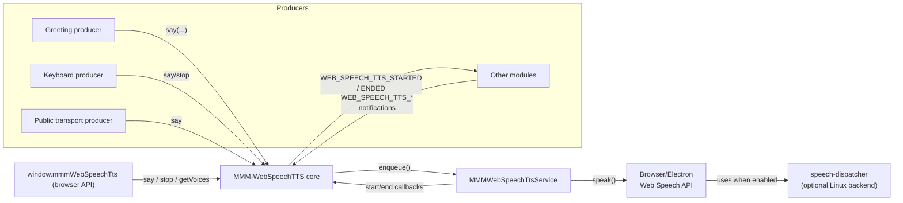

# MMM-WebSpeechTTS

A Text-To-Speech service module for [MagicMirror²](https://github.com/MagicMirrorOrg/MagicMirror) that wraps the browser Web Speech API and exposes a reusable queue with translation-aware producers.

## Project status

The module focuses on providing a speech service and is ready for day-to-day tinkering. Expect APIs and defaults to evolve; feedback and contributions are very welcome!

## Features

- 🔊 Central speech queue driven by the browser’s Web Speech API (no server required).
- 🌐 Automatic language detection with optional overrides for language, voice, rate, pitch, and volume.
- 💬 Notification-based API (`WEB_SPEECH_TTS_*`) for other modules to enqueue or stop speech.
- 🖥️ Lightweight browser helper (`window.mmmWebSpeechTts`) for custom scripts, debug consoles, and bookmarklets.
- 🤝 Built-in producers:
  - Startup greeting (greeting + current time).
  - Keyboard shortcuts (`g`, `s`, `t`) for greeting, stop, and time.
  - MMM-PublicTransportHafas integration for departure announcements.
- 🔁 Simple FIFO speech queue—every request lines up automatically.
- 🌍 English and German localizations with automatic fallback.

## Architecture overview



When MagicMirror² is started with `--enable-speech-dispatcher` (recommended on Linux), the Electrons’s Web Speech API will route synthesis requests to the system-level `speech-dispatcher` daemon, unlocking voices such as those provided by `espeak-ng`.

If you are running MagicMirror² in a browser (e.g., Firefox or Chrome), the module will use the built-in voices available in that browser. And `espeak-ng` nor `speech-dispatcher` nor `--enable-speech-dispatcher` are required.

## Installation

1. Clone this module into your MagicMirror² modules directory.

   ```bash
   cd ~/MagicMirror/modules
   git clone https://github.com/KristjanESPERANTO/MMM-WebSpeechTTS
   ```

2. (Optional) Install `espeak-ng` and `speech-dispatcher` to add additional voices for Electron on Linux:

   ```bash
   sudo apt-get install espeak-ng speech-dispatcher
   ```

## Configuration

Add the module to your `config.js` and customize the service and producers as needed:

```js
{
  module: "MMM-WebSpeechTTS",
  position: "top_left",
  config: {
    hidden: true,
    speechLang: "en-US",
    speechVoice: "",
    speechRate: 1,
    speechPitch: 1,
    speechVolume: 1,
    translationLang: "",
    producers: {
      greeting: {
        enabled: true,
        delay: 8000
      },
      keyboard: {
        enabled: true,
        shortcuts: {
          greeting: "g",
          stop: "s",
          time: "t"
        }
      },
      publicTransport: {
        enabled: true,
        shortcut: "d"
      }
    }
  }
}
```

### Core options

| Option            | Default              | Description                                                                                 |
| ----------------- | -------------------- | ------------------------------------------------------------------------------------------- |
| `hidden`          | `true`               | Hide the text wrapper (set to `false` to display current speech text).                      |
| `text`            | `"MMM-WebSpeechTTS"` | Placeholder text shown when idle and `hidden:false`.                                        |
| `speechLang`      | `""`                 | BCP-47 language tag. If empty, resolves from `config.locale`/`config.language`.             |
| `speechVoice`     | `""`                 | Preferred voice name. Leave empty to auto-select the first matching voice for `speechLang`. |
| `speechRate`      | `1`                  | Playback rate (0.1 – 10). Overrides available per job.                                      |
| `speechPitch`     | `1`                  | Pitch (0 – 2). Overrides available per job.                                                 |
| `speechVolume`    | `1`                  | Volume (0 – 1). Overrides available per job.                                                |
| `translationLang` | `""`                 | Force translation language; otherwise derived from `speechLang` or MagicMirror locale.      |
| `service`         | `{}`                 | Optional overrides mirroring the core options above (useful when sharing config snippets).  |

### Producer options

| Producer          | Key                         | Description                                                                              |
| ----------------- | --------------------------- | ---------------------------------------------------------------------------------------- |
| `greeting`        | `producers.greeting`        | `enabled`, optional `delay` (ms) before speaking.                                        |
| `keyboard`        | `producers.keyboard`        | `enabled`, custom `shortcuts` for `greeting`, `stop`, `time`. Keys are case-insensitive. |
| `publicTransport` | `producers.publicTransport` | `enabled`, keyboard `shortcut`. Requires MMM-PublicTransportHafas in your mirror.        |

## Notification API

Send notifications from any module to control the speech queue:

| Notification                 | Direction | Payload                                                                               |
| ---------------------------- | --------- | ------------------------------------------------------------------------------------- |
| `WEB_SPEECH_TTS_SAY`         | inbound   | `{ text: "Hello", id?, lang?, voice?, rate?, pitch?, volume? }`                       |
| `WEB_SPEECH_TTS_STOP`        | inbound   | `{ id? }` — stop a specific job or everything when `id` is omitted.                   |
| `WEB_SPEECH_TTS_GET_VOICES`  | inbound   | `{ requestId? }` — request available voices (async).                                  |
| `WEB_SPEECH_TTS_VOICES_LIST` | outbound  | `{ voices: VoiceInfo[], requestId }` — list of `{name, lang, localService, default}`. |
| `WEB_SPEECH_TTS_STARTED`     | outbound  | `{ id, text }` — emitted when a job starts speaking.                                  |
| `WEB_SPEECH_TTS_ENDED`       | outbound  | `{ id, text, reason, error }` — emitted when a job finishes or is cancelled.          |

> **Legacy:** The old `WebSpeechTTS` notification still works but logs a warning. Please migrate to `WEB_SPEECH_TTS_SAY`.

### Using the browser helper

The module exposes a small helper on the MagicMirror browser window:

```js
// enqueue speech
window.mmmWebSpeechTts.say({
  text: "The kettle is ready."
});

// stop everything
window.mmmWebSpeechTts.stop();

// fetch voices (optional requestId to match responses)
window.mmmWebSpeechTts.getVoices("debug-panel");
```

This is handy when debugging in the dev tools console or when creating custom producers outside the module.

## Keyboard control

Default shortcuts reflect the sample configuration above:

| Key | Action                                | How to customize                               |
| --- | ------------------------------------- | ---------------------------------------------- |
| `g` | Speak greeting                        | `config.producers.keyboard.shortcuts.greeting` |
| `s` | Stop speech                           | `config.producers.keyboard.shortcuts.stop`     |
| `t` | Speak current time                    | `config.producers.keyboard.shortcuts.time`     |
| `d` | Departures (MMM-PublicTransportHafas) | `config.producers.publicTransport.shortcut`    |

Disable the keyboard producer entirely via `config.producers.keyboard.enabled = false` if you rely on external input (e.g., MQTT, sensors).

## Run it

MagicMirror² must be launched with speech synthesis enabled:

1. **Adapt `package.json`** of MagicMirror²
   - Add: `"start:tts": "speech-dispatcher -s -t 0 & node --run start:wayland -- --enable-speech-dispatcher"`
   - Start with `node --run start:tts`
2. **Direct command**
   - Run: `speech-dispatcher -s -t 0 & node --run start:wayland -- --enable-speech-dispatcher`
3. **Server mode**
   - Run `node --run server` and open MagicMirror² in a browser supporting the Web Speech API (Firefox works best on Linux).

## Update

```bash
cd ~/MagicMirror/modules/MMM-WebSpeechTTS
git pull
```

## ToDo/Ideas

- Add producer for all core MM modules (e.g., weather, news, calendar).
- Add producer to announce when a new module is loaded.
- Add practical examples for custom producers.
- Add practical examples for use cases.
  - Announcing important events (e.g., reminders, alarms).
  - Providing real-time updates (e.g., weather, news).
  - Announcing notifications (e.g., emails, messages).
  - Read news headlines aloud on GPIO button press.
  - ... your idea here!
- Mention in MMM-Public-TransportHafas that TTS is possible with this module
- Expand translations beyond English and German.
- Document additional producer examples (sensors, calendar, reminders).

## Contributing

If you find any problems, bugs or have questions, please [open a GitHub issue](https://github.com/KristjanESPERANTO/MMM-WebSpeechTTS/issues) in this repository.

Pull requests are of course also very welcome 🙂

### Code of Conduct

Please note that this project is released with a [Contributor Code of Conduct](CODE_OF_CONDUCT.md). By participating in this project you agree to abide by its terms.

### Developer commands

- `npm install` — install development dependencies.
- `node --run lint` — run linting and formatting checks.
- `node --run lint:fix` — auto-fix lint and formatting issues.
- `node --run test` — lint + format + spelling.
- `node --run test:spelling` — spelling only.

## License

This project is licensed under the MIT License - see the [LICENSE](LICENSE.md) file for details.
